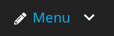

# UpAssist Mega Menu

Render a node based mega menu on your Neos website.

## What does it do?
This package provides a way to add a mega menu to your Neos website.

It creates a childNode where menu items can be added. Submenu's can be created by adding 
menu items, and optionally labels and columns.

### PreviewMode
This package comes with a previewMode for easier editing the menu.



## Installation
Add the package to your Site package.

Install using composer: 

```bash
composer require --no-update upassist/megamenu
```

If all goes well, run 

```bash
composer update upassist/megamenu
```

## Setup
Add the mixin `UpAssist.MegaMenu:Mixin.Menu` to your home page definition.

Next run the node repair command to create the proper childNode.

```bash
./flow node:repair
```

Finish by implementing your styles.

## Optional
This menu is set up using Fusion AFX. If you want to override the implementation in your project, you are
completely free to do so.
